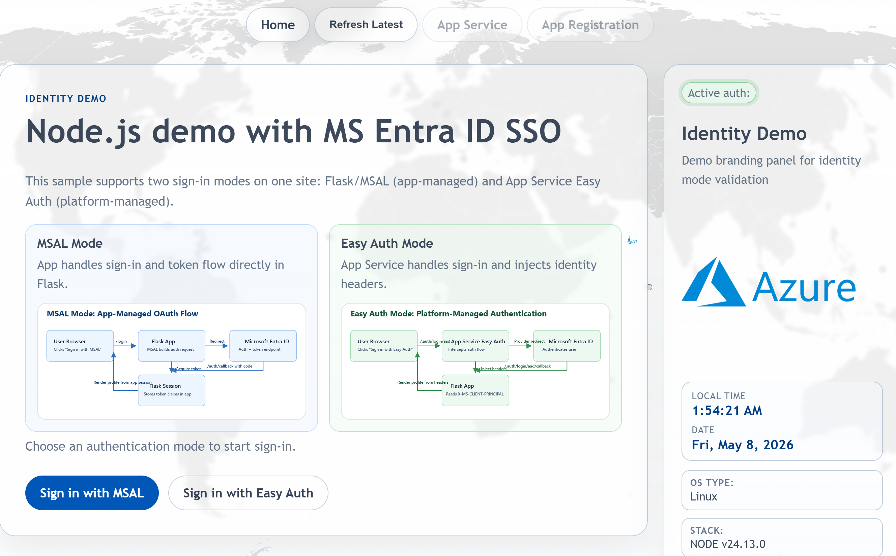
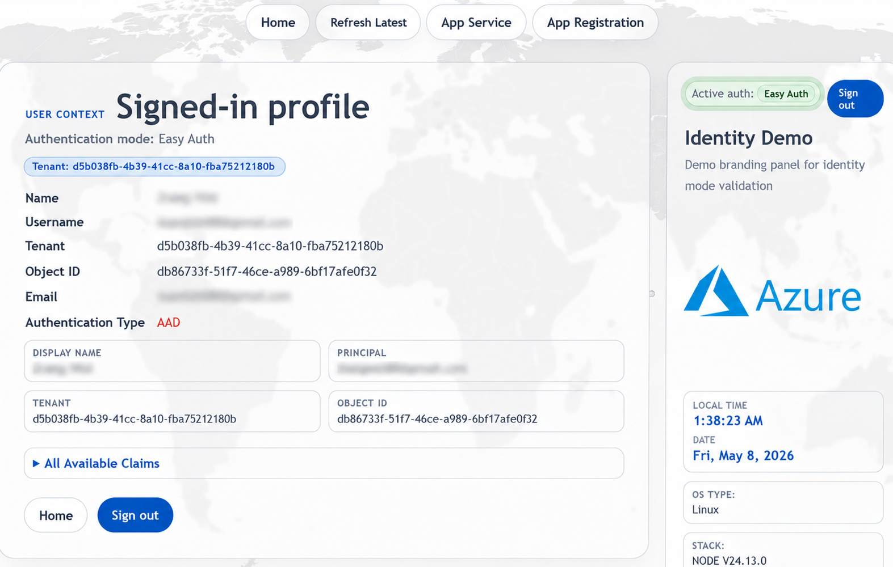

# web-ccoedemo-node

Node.js and Express implementation of the `web-ccoedemo` Entra authentication demo site.

## MOC

- [What This Repo Does](#what-this-repo-does)
- [Screenshots](#screenshots)
- [App Structure](#app-structure)
- [Local Run](#local-run)
- [Environment Variables](#environment-variables)
- [Main Routes](#main-routes)
- [Deployment Files](#deployment-files)
- [Additional Docs](#additional-docs)
- [Notes](#notes)
- [Architecture](docs/ARCHITECTURE.md)
- [Deployment Methods](docs/DEPLOYMENT_METHODS.md)
- [Validation Guide](docs/VALIDATION.md)
- [Shared Runner Hygiene Standard](docs/SHARED-RUNNER-HYGIENE-STANDARD.md)
- [Git Extraheader Runner Issue](docs/GIT-EXTRAHEADER-RUNNER-ISSUE.md)

## What This Repo Does

This app demonstrates two Azure App Service sign-in models in one UI:

- `MSAL` app-managed sign-in with `@azure/msal-node`
- `Easy Auth` platform-managed sign-in through App Service authentication

The app renders a shared landing page plus profile views that let you compare claims, active auth mode, session timeline, and runtime metadata.

## Screenshots






## App Structure

- `app.js`: Express app, routing, MSAL flow, Easy Auth header parsing, session handling
- `views/`: Nunjucks templates for the home page, profile page, and auth error page
- `static/`: images and flow diagrams used by the UI
- `azure-pipelines.yml`: primary Azure DevOps ZIP deploy pipeline
- `.github/workflows/azure-webapp.yml`: GitHub Actions build, deploy, and mirror-publish workflow
- `run_from_package.yml`: alternate package-mounted deployment pipeline
- `docs/`: architecture, deployment, validation, and runner notes

## Local Run

Prerequisite:

- Node.js `24` or newer

Run locally:

```bash
npm ci
node --check app.js
npm start
```

Default local URL:

- `http://localhost:3000`

## Environment Variables

Core Entra settings:

- `AAD_CLIENT_ID`
- `AAD_CLIENT_SECRET`
- `AAD_TENANT_ID`
- `AAD_SCOPES`
- `AAD_REDIRECT_PATH`
- `AAD_REDIRECT_URI`
- `AAD_POST_LOGOUT_REDIRECT_URI`

Easy Auth settings:

- `EASY_AUTH_LOGIN_PATH`
- `EASY_AUTH_LOGOUT_PATH`

Operational settings:

- `SESSION_SECRET`
- `APP_SERVICE_PORTAL_URL`
- `APP_REGISTRATION_PORTAL_URL`
- `APP_SERVICE_NAME`
- `APP_SERVICE_SUBSCRIPTION_ID`
- `APP_SERVICE_RESOURCE_GROUP`

Compatibility note:

- `FLASK_SECRET_KEY` is still accepted as a fallback session secret name for cross-repo compatibility, even though this app is Node/Express.

## Main Routes

- `GET /`: landing page with both sign-in choices
- `GET /login/msal`: start MSAL authorization code flow
- `GET /login/easyauth`: start Easy Auth sign-in
- `GET /auth/callback`: MSAL callback path by default
- `GET /profile/msal`: MSAL-backed profile view
- `GET /profile/easyauth`: Easy Auth-backed profile view
- `GET /logout/msal`: clear local MSAL session
- `GET /logout/easyauth`: route through App Service logout
- `GET /logout/all`: clear local session and Easy Auth if active

## Deployment Files

Repo-shipped deployment automation:

- `azure-pipelines.yml` builds `app.zip`, stages runtime files without `node_modules`, and deploys with `az webapp deploy` plus App Service build automation
- `.github/workflows/azure-webapp.yml` builds the same ZIP artifact, performs deployment prechecks, optionally deploys to App Service, and can publish to GitHub and Azure DevOps mirror repos
- `run_from_package.yml` builds a self-contained ZIP with `node_modules` and deploys with `WEBSITE_RUN_FROM_PACKAGE=1`

Current defaults:

- Node baseline is `24`
- Primary App Service target is `web-platform-eus-dev-node`
- Windows targets use `WEBSITE_NODE_DEFAULT_VERSION=~24`
- Linux targets use `linuxFxVersion=NODE|24-lts` and `npm start`

## Additional Docs

- [Architecture](docs/ARCHITECTURE.md)
- [Deployment Methods](docs/DEPLOYMENT_METHODS.md)
- [Validation Guide](docs/VALIDATION.md)
- [Shared Runner Hygiene Standard](docs/SHARED-RUNNER-HYGIENE-STANDARD.md)
- [Git Extraheader Runner Issue](docs/GIT-EXTRAHEADER-RUNNER-ISSUE.md)

## Notes

- Session storage is currently the default in-memory store from `express-session`.
- The app supports both Windows and Linux Azure App Service targets.
- Windows App Service 32-bit worker compatibility is documented and has been validated for this app.
- The repo documentation is centered on runtime behavior and deployment operations rather than Terraform structure.
