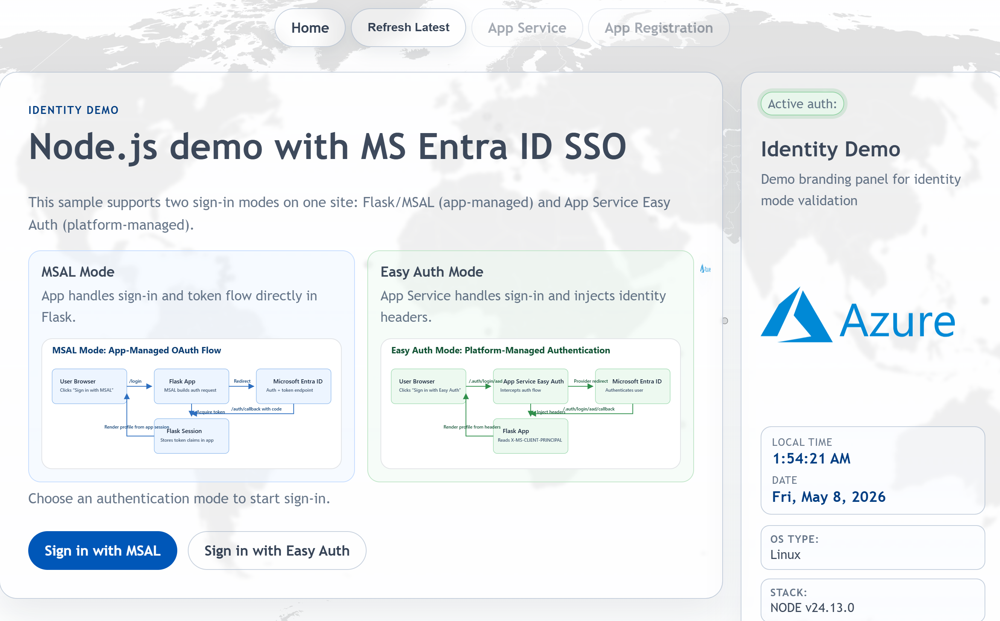

# web-ccoedemo-node

Node.js and Express implementation of the `web-ccoedemo` Entra authentication demo site.

## Contents

- [What This Repo Does](#what-this-repo-does)
- [Screenshots](#screenshots)
- [App Structure](#app-structure)
- [Local Run](#local-run)
- [Environment Variables](#environment-variables)
- [Main Routes](#main-routes)
- [Deployment Files](#deployment-files)
- [Additional Docs](#additional-docs)
- [Notes](#notes)
- [Architecture](docs/ARCHITECTURE.md)
- [Deployment Methods](docs/DEPLOYMENT_METHODS.md)
- [Validation Guide](docs/VALIDATION.md)
- [Repository Hygiene](docs/VALIDATION.md#repository-and-branch-hygiene)
- [Shared Runner Hygiene Standard](docs/SHARED-RUNNER-HYGIENE-STANDARD.md)
- [Git Extraheader Runner Issue](docs/GIT-EXTRAHEADER-RUNNER-ISSUE.md)

## What This Repo Does

This app demonstrates two Azure App Service sign-in models in one UI:

- `MSAL` app-managed sign-in with `@azure/msal-node`
- `Easy Auth` platform-managed sign-in through App Service authentication

The app renders a shared landing page plus profile views that let you compare claims, active auth mode, session timeline, and runtime metadata.

## Screenshots




## App Structure

- `app.js`: Express app, routing, MSAL flow, Easy Auth header parsing, session handling
- `views/`: Nunjucks templates for the home page, profile page, and auth error page
- `static/`: images and flow diagrams used by the UI
- `azure-pipelines.yml`: primary Azure DevOps ZIP deploy pipeline
- `.github/workflows/azure-webapp.yml`: GitHub Actions build, deploy, and mirror-publish workflow
- `run_from_package.yml`: alternate package-mounted deployment pipeline
- `docs/`: architecture, deployment, validation, and runner notes

## Local Run

Prerequisite:

- Node.js `24.x` (the validation command rejects other major versions)

Run locally:

```bash
npm ci
npm run check
npm start
```

Default local URL:

- `http://localhost:3000`

## Environment Variables

Core Entra settings:

- `AAD_CLIENT_ID`
- `AAD_CLIENT_SECRET`
- `AAD_TENANT_ID`
- `AAD_SCOPES`
- `AAD_REDIRECT_PATH`
- `AAD_REDIRECT_URI`
- `AAD_POST_LOGOUT_REDIRECT_URI`

Easy Auth settings:

- `EASY_AUTH_LOGIN_PATH`
- `EASY_AUTH_LOGOUT_PATH`

Operational settings:

- `SESSION_SECRET`
- `APP_BASE_URL`
- `APP_SERVICE_PORTAL_URL`
- `APP_REGISTRATION_PORTAL_URL`
- `APP_SERVICE_NAME`
- `APP_SERVICE_SUBSCRIPTION_ID`
- `APP_SERVICE_RESOURCE_GROUP`

Compatibility note:

- `FLASK_SECRET_KEY` is still accepted as a fallback session secret name for cross-repo compatibility, even though this app is Node/Express.

## Main Routes

- `GET /`: landing page with both sign-in choices
- `GET /login/msal`: start MSAL authorization code flow
- `GET /login/easyauth`: start Easy Auth sign-in
- `GET /auth/callback`: MSAL callback path by default
- `GET /profile/msal`: MSAL-backed profile view
- `GET /profile/easyauth`: Easy Auth-backed profile view
- `GET /logout/msal`: clear local MSAL session
- `GET /logout/easyauth`: route through App Service logout
- `GET /logout/all`: clear local session and Easy Auth if active
- `GET /health`: minimal unauthenticated readiness probe (`/healthz` remains an alias)
- `GET /metrics`: Prometheus-compatible request and authentication outcome counters

## Deployment Files

Repo-shipped deployment automation:

- `azure-pipelines.yml` validates pushes and pull requests for `main`, `dev`, and `sbx`, runs lint/tests/dependency audit, builds a self-contained `app.zip`, and deploys the `sbx` and `dev` branches with run-from-package
- `.github/workflows/azure-webapp.yml` validates pull requests and pushes to `main`, uses least-privilege default permissions, packages production dependencies in the ZIP, creates release tags only from `main`, and optionally deploys and publishes mirrors. GitHub staging snapshots exclude `.github/` so workflows and Dependabot run only in the source repository.
- `run_from_package.yml` builds a self-contained ZIP with `node_modules` and deploys with `WEBSITE_RUN_FROM_PACKAGE=1`

Current defaults:

- Node baseline is `24`
- Azure DevOps deploy stages target `web-platform-cc-sbx-node` from `sbx` and `web-platform-cc-dev-node` from `dev`; `main` currently builds and validates without a deployment stage
- GitHub Actions resolves targets from the protected GitHub Environment selected by `DEPLOY_ENV`
- The shared deploy template supports an optional secondary App Service target, but it is blank by default in both orchestrators
- Windows targets use `WEBSITE_NODE_DEFAULT_VERSION=~24`
- Linux targets use `linuxFxVersion=NODE|24-lts` and `cd /home/site/wwwroot && npm start`

## Additional Docs

- [Architecture](docs/ARCHITECTURE.md)
- [Deployment Methods](docs/DEPLOYMENT_METHODS.md)
- [Validation Guide](docs/VALIDATION.md)
- [Shared Runner Hygiene Standard](docs/SHARED-RUNNER-HYGIENE-STANDARD.md)
- [Git Extraheader Runner Issue](docs/GIT-EXTRAHEADER-RUNNER-ISSUE.md)

## Notes

- Production and Azure App Service startup require a `SESSION_SECRET` of at
  least 32 characters. Azure is detected from `WEBSITE_SITE_NAME`, so this
  safeguard does not depend on `NODE_ENV` being configured separately.
- `APP_BASE_URL` should be the canonical HTTPS origin; Azure App Service falls back to `WEBSITE_HOSTNAME`.
- Session storage is the default in-memory store from `express-session`; use one App Service instance or configure a shared store before scaling out.
- The app supports both Windows and Linux Azure App Service targets.
- Application, HTTP-request, and authentication lifecycle logs are emitted as one-line JSON to standard output/error for App Service log collection. `/metrics` exposes process-local Prometheus counters without identity data.
- Windows App Service 32-bit worker compatibility is documented and has been validated for this app.
- Automated dependency updates are configured in `.github/dependabot.yml`.
- See [SECURITY.md](SECURITY.md) for vulnerability reporting and production security requirements.
